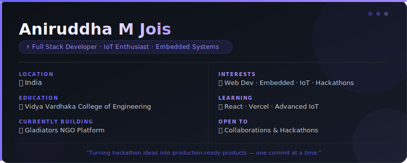
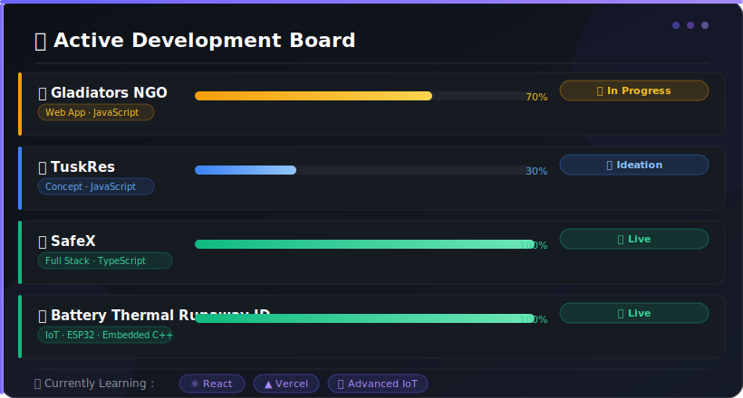

<!-- Animated Wave Header -->

<!-- Animated Typing Subtitle -->

 

<!-- Contact Icons -->

&nbsp;&nbsp;

&nbsp;&nbsp;

&nbsp;&nbsp;

 

## 🧑‍💻 &nbsp;About Me

  

---

## 🚧 &nbsp;What I'm Building

  

---

## 🛠️ &nbsp;Tech Stack & Skills

#### ⚙️ &nbsp;Embedded & Hardware

#### 💻 &nbsp;Languages

#### 🌐 &nbsp;Web Technologies

#### 🔧 &nbsp;Tools & Platforms

---

## 🏆 &nbsp;Hackathon Wins

<table>
<tr>
<td align="center" width="46%">
 

### 🛡️ SafeX
**Clash of Cortex Hackathon**

AI-powered women's safety platform with real-time threat detection, one-tap SOS alerts & live location tracking.

`TypeScript` &nbsp; `Next.js` &nbsp; `Firebase`

</td>
<td width="4%"></td>
<td align="center" width="46%">
 

### 🔋 Battery Thermal Runaway ID
**ThermoSpark Hackathon**

Embedded IoT system on ESP32 with C++ firmware to detect & predict battery thermal runaway events in real time.

`ESP32` &nbsp; `Embedded C++` &nbsp; `IoT`

</td>
</tr>
</table>

---

## 🚀 &nbsp;Projects

&nbsp;<b>🛡️ SafeX</b> &nbsp;—&nbsp; Women's Safety Platform &nbsp;&nbsp;

 

> Real-time threat detection and emergency response platform built for women's safety.

| Field | Details |
|:--|:--|
| **Stack** | TypeScript · Next.js · Firebase |
| **Status** | ✅ Live & Maintained |
| **Won** | 🥇 1st Place — Clash of Cortex |

&nbsp;<b>🔋 Battery Thermal Runaway Identifier</b> &nbsp;—&nbsp; IoT Safety System &nbsp;&nbsp;

 

> ESP32-based embedded system to detect and predict battery thermal runaway conditions.

| Field | Details |
|:--|:--|
| **Stack** | ESP32 · Embedded C++ · IoT |
| **Status** | ✅ Live & Maintained |
| **Won** | 🥈 2nd Place — ThermoSpark |

&nbsp;<b>🚀 FestFlow</b> &nbsp;—&nbsp; Event Management & Safety Dashboard

 

> Real-time IoT Dashboard for large-scale event management, vital telemetry, and safety monitoring.

| Field | Details |
|:--|:--|
| **Stack** | HTML5 · CSS3 · JavaScript · WebSerial · Leaflet.js |
| **Status** | ✅ Live & Maintained |

&nbsp;<b>🤝 Gladiators NGO</b> &nbsp;—&nbsp; NGO Community Platform

 

> A digital platform to connect, empower and coordinate NGO communities.

| Field | Details |
|:--|:--|
| **Stack** | React · JavaScript · Vite · CSS |
| **Status** | 🔨 Actively Building |

&nbsp;<b>🐘 TuskRes</b> &nbsp;—&nbsp; Concept in Development

 

> An innovative concept currently in ideation and early development phase.

| Field | Details |
|:--|:--|
| **Stack** | JavaScript |
| **Status** | 💡 Ideation Phase |

---

## 📊 &nbsp;GitHub Analytics

<!-- Streak Stats (Total Contributions & Current Streak only) -->

  

<!-- Activity Graph -->

---

## 🐍 &nbsp;Contribution Snake

<picture>
  <source media="(prefers-color-scheme: dark)" srcset="https://raw.githubusercontent.com/AniruddhaMJois/AniruddhaMJois/output/github-snake-dark.svg" />
  <source media="(prefers-color-scheme: light)" srcset="https://raw.githubusercontent.com/AniruddhaMJois/AniruddhaMJois/output/github-snake.svg" />
  
</picture>

> ⏳ *Snake animation auto-generates via GitHub Actions — run the workflow manually under the [Actions tab](https://github.com/AniruddhaMJois/AniruddhaMJois/actions) for instant results!*

---

## 📈 &nbsp;Real-Time Activity

<!--START_SECTION:activity-->
1. 🔨 Currently building **Gladiators NGO** — a platform for NGO community engagement
2. 💡 Ideating on **TuskRes** — exploring innovative solutions
3. 🛡️ Maintaining **SafeX** — women's safety platform
4. 🔋 Iterating on **Battery Thermal Runaway Identifier**
5. 🚀 Maintained **FestFlow** — real-time IoT event dashboard
<!--END_SECTION:activity-->

---

### 💬 &nbsp;Let's Connect & Collaborate!

<em>I'm always open to collaborating on innovative projects and hackathons. Feel free to reach out!</em>

&nbsp;&nbsp;

&nbsp;&nbsp;

&nbsp;&nbsp;

  

